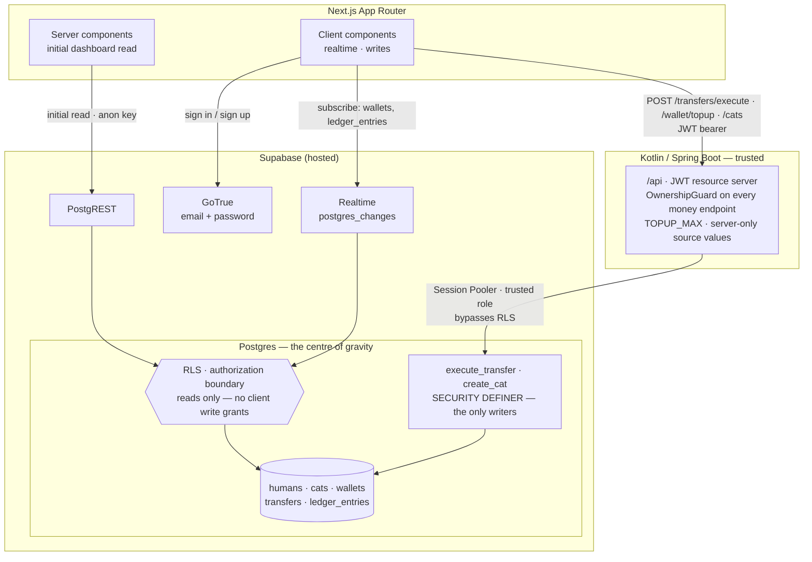
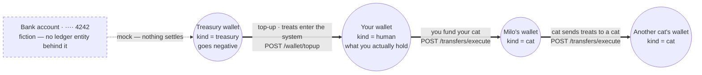

# MeowPay

MeowPay is a full-stack treat-money movement slice built with Next.js, Kotlin/Spring Boot,
and Supabase.

This repository is milestone-driven. The execution loop lives in [AGENTS.md](AGENTS.md), the
roadmap lives in [docs/MILESTONES.md](docs/MILESTONES.md), and architectural decisions live in
[docs/adr](docs/adr).

## Current State

M0 provides the foundation:

- `backend/` contains a Spring Boot Kotlin resource-server skeleton.
- `frontend/` contains a Next.js App Router shell with Tailwind and shadcn/ui configuration.
- `supabase/migrations/` is present for the ledger migrations that begin in M2.
- `.env.example` documents the environment variables expected by the two runtimes.

## System design

Two paths reach the data, and the difference between them is the whole security model.

**Reads and realtime go straight to Postgres.** The browser holds the Supabase anon key — it is
public, it is in the JavaScript bundle — so the authorization boundary cannot live in the frontend,
and it cannot live only in Kotlin, because that path never touches Kotlin. **RLS is the boundary**
([ADR 0012](docs/adr/0012-rls-ownership-subquery.md)).

**Writes go through Kotlin**, which connects as a trusted role and therefore *bypasses* RLS. So
every money endpoint re-checks ownership itself. The two mechanisms defend two different paths, and
neither is redundant.



Kotlin is deliberately thin: it validates the JWT, checks ownership, and calls a function. The
atomic transfer is plpgsql ([ADR 0008](docs/adr/0008-atomic-plpgsql-transfer.md)), authorization is
RLS ([ADR 0012](docs/adr/0012-rls-ownership-subquery.md)), and realtime is `postgres_changes`
([ADR 0013](docs/adr/0013-realtime-scoping-via-rls.md)) — the centre of gravity is the database
([ADR 0001](docs/adr/0001-stack-and-topology.md)).

## How treats move

**The wallet is the account** ([ADR 0021](docs/adr/0021-wallet-is-the-account.md)). A wallet has a
`kind` — `treasury`, `human`, or `cat` — and money moves between wallets, never between the things
that own them. The treasury belongs to nobody: it is not a cat, and not a human.

Every treat that exists is minted by the treasury, which is allowed to go **negative** — that
negative number is exactly the count of treats in circulation. Every other wallet is forbidden from
going negative, by a `CHECK` constraint.



**Flow is one-directional and the legal routes are enumerated, not assumed.** `execute_transfer`
permits exactly these three, and records anything else as a `failed` row with
`failure_reason = 'unsupported_route'` — there is no cash-out and no claw-back:

| From | To | What it is |
|---|---|---|
| `treasury` | `human` | top-up — the only way treats enter |
| `human` | `cat` | a human funds a cat |
| `cat` | `cat` | a cat sends treats to a cat |

Every arrow above is the **same** `execute_transfer` Postgres function
([ADR 0008](docs/adr/0008-atomic-plpgsql-transfer.md)) — same idempotency, same ordered locking,
same atomicity. It writes two ledger rows per transfer, a debit and a credit, instead of updating a
single balance ([ADR 0006](docs/adr/0006-ledger-first-money-movement.md)). That is what lets the
system make one strong guarantee:

> **The signed sum of every ledger entry, across every wallet, is always zero.**

No treat is ever created or destroyed without a matching counterparty entry explaining where it came
from ([ADR 0021](docs/adr/0021-wallet-is-the-account.md)).

Top-up is the one transfer whose sender is the treasury, and it is therefore the one endpoint that
accepts **no** wallet identifier from the client — the target is resolved from the JWT. A merged
endpoint would need an ownership exception for the account that mints treats
([ADR 0023](docs/adr/0023-funding-path-topup-mints-to-the-human.md)).

### Deliberate demo boundaries

- **Treats are freely mintable.** The bank account is a label; nothing settles behind a top-up. Real
  MeowPay would authorize with a payment provider and credit only on settlement — which makes
  top-up asynchronous and introduces a `pending` state that
  [ADR 0009](docs/adr/0009-idempotency-and-status.md) deliberately does not have.
- **The cat roster is global.** Any authenticated human can enumerate every cat name, because you
  need to find recipients. Real MeowPay would gate discovery behind search or a friends list
  ([ADR 0012](docs/adr/0012-rls-ownership-subquery.md)).
- **`manual` vs `agent` is client-asserted.** It labels which UI was used and never affects balances
  or authorization. `topup` is server-only and rejected from `/transfers/execute`
  ([ADR 0023](docs/adr/0023-funding-path-topup-mints-to-the-human.md)).

## Local Setup Stub

Copy `.env.example` to `.env` and fill it with project-specific values before running either
runtime. Do not commit `.env`.

The full clean-clone runbook is completed in M10. Until then, local commands are:

```bash
cd backend
./gradlew bootRun
```

```bash
cd frontend
npm install
npm run dev
```
