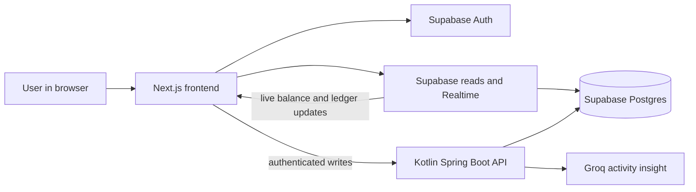
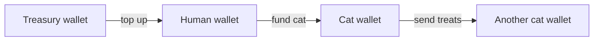

# MeowPay

MeowPay is a full-stack project for moving fictional treats between people and their
cats. It is built with Next.js, Kotlin/Spring Boot, and Supabase.

## What we built

- Email/password sign-up and sign-in backed by Supabase Auth.
- A responsive dashboard with a human wallet, cat wallets, balances, and a realtime activity
  trail.
- A transfer flow for funding cats and sending treats between cats, with confirmation and
  idempotency protection.
- Top-ups into the signed-in human's wallet.
- Activity charts and an AI-generated account-activity summary.
- Database migrations, access controls, backend integration tests, frontend tests, Docker images,
  and Docker Compose for the application services.

The project is organised as a frontend, backend, and Supabase migration set:

```text
frontend/              Next.js application
backend/               Kotlin / Spring Boot API
supabase/migrations/   database schema and functions
docker-compose.yml     application runtime
```

## Stack

- **Frontend:** Next.js 14, React 18, TypeScript, Tailwind CSS, Supabase SSR, React Hook Form,
  Zod, and Lucide icons.
- **Backend:** Kotlin, Spring Boot 3, Spring Security, Spring JDBC, and PostgreSQL.
- **Platform:** Supabase for authentication, database, row-level access control, and realtime;
  Groq for the activity-summary feature.
- **Delivery:** Docker, Docker Compose, Gradle, and npm.

## How we built it

- Started with written specifications: milestones define delivery order and acceptance checks, and
  ADRs capture implementation decisions.
- **Claude Opus** for planning: decomposing the requirements into milestones, requirements, and
  implementation decisions.
- **GPT-5.6 Terra** for execution: implementing the application slice-by-slice from those specs.
- **Claude Sonnet** for end-to-end testing and follow-up fixes.
- Recorded the workflow in [AGENTS.md](AGENTS.md),
  [the milestone roadmap](docs/MILESTONES.md), and [the ADRs](docs/adr/). The AI agents were
  development collaborators, not part of MeowPay's runtime.

## How the application works



## Wallet flow



The activity insight is backend-mediated; it summarizes activity but does not move money.

## Testing

- **Backend:** JUnit 5 via `spring-boot-starter-test`, Spring Security Test, and Testcontainers
  PostgreSQL for integration tests against the real migrations.
- **Frontend:** Vitest, React Testing Library, `@testing-library/user-event`,
  `@testing-library/jest-dom`, and jsdom.
- **End to end:** Playwright.

## Run the application

With the required environment values already provided:

1. Place the supplied `.env` file in the repository root. If you need to create one, use
   [.env.example](.env.example) as the variable reference.
2. Ensure the supplied Supabase project has already had the SQL files in
   `supabase/migrations/` applied in filename order. Migrations are **not** run by the production
   Docker containers at startup.
3. Build and start the application:

   ```bash
   docker compose up --build
   ```

4. Open [http://localhost:3000](http://localhost:3000). The backend is exposed on port 8080;
   its health endpoint is [http://localhost:8080/api/health](http://localhost:8080/api/health).

The `.env` file contains the required Supabase, JWT, Groq, and frontend values.

To stop the application:

```bash
docker compose down
```
