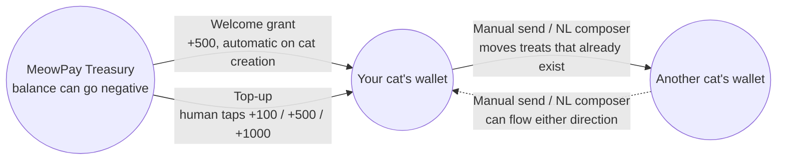

# MeowPay

MeowPay is a full-stack treat-money movement slice built with Next.js, Kotlin/Spring Boot,
and Supabase.

This repository is milestone-driven. The execution loop lives in [AGENTS.md](AGENTS.md), the
roadmap lives in [docs/MILESTONES.md](docs/MILESTONES.md), and architectural decisions live in
[docs/adr](docs/adr).

## Current State

M0 provides the foundation:

- `backend/` contains a Spring Boot Kotlin resource-server skeleton.
- `frontend/` contains a Next.js App Router shell with Tailwind and shadcn/ui configuration.
- `supabase/migrations/` is present for the ledger migrations that begin in M2.
- `.env.example` documents the environment variables expected by the two runtimes.

## How treats move

Cats hold the only wallets in MeowPay — humans have no balance of their own. Every treat that
exists is minted by a single system account, the **MeowPay Treasury**, and moves from there
through the same transfer function as any cat-to-cat send. The treasury is allowed to go
negative (that negative number is just the count of treats in circulation); a normal cat's
wallet is never allowed to.



Every arrow above is the same `execute_transfer` Postgres function
([ADR 0008](docs/adr/0008-atomic-plpgsql-transfer.md)), which writes two ledger rows per
transfer — a debit and a credit — instead of updating a single balance. That's what lets the
system make one strong guarantee: **the signed sum of every ledger entry, across every wallet,
is always zero.** No treat is ever created or destroyed without a matching counterparty entry
explaining where it came from ([ADR 0007](docs/adr/0007-treasury-backed-funding.md)).

## Local Setup Stub

Copy `.env.example` to `.env` and fill it with project-specific values before running either
runtime. Do not commit `.env`.

The full clean-clone runbook is completed in M10. Until then, local commands are:

```bash
cd backend
./gradlew bootRun
```

```bash
cd frontend
npm install
npm run dev
```
